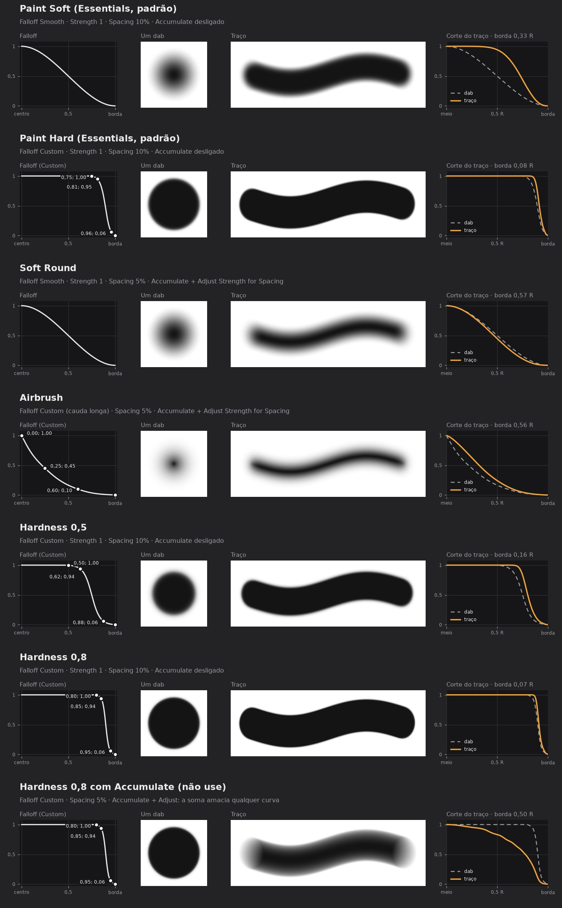

# Brush soft no Texture Paint (Blender 5.2)

Pesquisa de 2026-09-28, pedida pelo Vini: brush macio como o soft round do
Photoshop, já que o Texture Paint não tem Hardness.

Fontes: manual 5.2 local (`blender-manual-5.2-lts/manual/sculpt_paint/brush/`)
e código-fonte da branch `blender-v5.2-release` (arquivos citados abaixo).
Os números vêm de `scripts/brush_soft_sim.py`, que reproduz as fórmulas do
código. **Não foi pintado na interface**: o bpy headless não abre viewport.
Confirmar no Blender do Vini.

Um cartão por brush em `img/cards/`: falloff com os pontos para copiar,
um dab, o traço e o corte do traço (laranja) contra o dab (tracejado).
Comparativo antigo, só com traços: `img/brush_soft_sheet.jpg`.

## Por que o Paint Soft parece duro

1. **Hardness só existe no Sculpt Mode** (manual, `brush_settings.rst`).
2. No modo de stroke Space, sem Accumulate, cada dab puxa o pixel em
   direção ao Strength com peso igual ao falloff naquele ponto
   (`paint_image_proj.cc`: `mask = acc + (max_mask - acc*falloff)`).
   Com spacing 10%, cada pixel recebe uns 10 dabs, e até a borda chega
   perto do Strength. O traço fica muito mais duro que o dab.
3. O Strength só escala o traço inteiro. Ele funciona como a Opacity do
   Photoshop e não muda a maciez.

| Configuração | Borda 10–90% | Meia altura |
|---|---|---|
| Um dab isolado, curva Smooth | 0,61 R | 0,50 R |
| Paint Soft padrão (Smooth, Strength 1, spacing 10%) | 0,33 R | 0,73 R |
| Paint Soft com Strength 0,3 | 0,33 R | 0,73 R |
| Paint Hard padrão | 0,08 R | 0,91 R |

R é o raio do brush. A meia altura é onde o traço chega a 50%: quanto
menor, mais degradê.

## A solução: Accumulate + Adjust Strength for Spacing

Com **Accumulate** ligado, os dabs se somam em linha reta
(`mask = acc + strength*falloff*fator`). **Adjust Strength for Spacing**
divide a força de cada dab pela sobreposição do traço
(`paint_stroke.cc`, `paint_stroke_integrate_overlap`). No Texture Paint esse
fator só é aplicado com Accumulate ligado (`paint_image_ops_paint.cc`).
O resultado é que o perfil do traço é a soma das fatias do falloff, sem
saturar: o degradê ocupa o traço todo.

| Configuração | Borda 10–90% | Meia altura |
|---|---|---|
| Accumulate + Adjust, Smooth | 0,57 R | 0,47 R |
| Accumulate + Adjust, Sharp | 0,59 R | 0,37 R |
| Accumulate + Adjust, cauda longa | 0,58 R | 0,31 R |
| Accumulate + Adjust, hardness 0,5 | 0,44 R | 0,64 R |

## Receita: soft round

1. Selecione o **Paint Soft** do Essentials e use **Duplicate Asset**
   (Sidebar → Tool → Brush Asset). Os brushes do Essentials não podem ser
   editados.
2. No painel do brush, ligue **Accumulate**. Ele aparece abaixo de Affect
   Alpha no brush Draw com stroke Space.
3. Em Stroke, deixe **Space**, ligue **Adjust Strength for Spacing** e
   use **Spacing 5%**. Com 10%, as curvas com platô ou cauda longa mostram
   os dabs em faixas; com 5% as faixas somem.
4. Falloff **Smooth** para soft round. Para airbrush, use a **Custom** com
   os pontos (0; 1), (0,25; 0,45), (0,6; 0,1), (1; 0).
5. Salve as mudanças no asset.

## Hardness pela curva Custom (Accumulate desligado)

O próprio Paint Hard do Essentials é uma curva Custom com os pontos
(0,75; 1), (0,81; 0,95), (0,96; 0,06), (1; 0). É a curva Smooth comprimida
para depois de 0,75. Para qualquer hardness h, use os pontos:

| Ponto | X | Y |
|---|---|---|
| 1 | h | 1 |
| 2 | h + 0,25·(1 − h) | 0,94 |
| 3 | h + 0,75·(1 − h) | 0,06 |
| 4 | 1 | 0 |

Antes do primeiro ponto a curva fica em 1 (extensão Horizontal, conferido
no bpy). **Deixe o Accumulate desligado no hardness**: a soma ao longo do
traço amacia qualquer curva, e o hardness 0,8 com Accumulate virou um
degradê largo (borda 0,50 R, cartão 07). Sem Accumulate, o traço segue o
dab: hardness 0,5 dá borda 0,16 R e 0,8 dá 0,07 R.

Resumo: **Accumulate para soft e airbrush; desligado para hardness médio
ou alto.** Salve um asset para cada um.

## Diferenças que continuam

- Com Accumulate, o Strength vira **Flow**, não Opacity. Passar de novo
  no mesmo traço escurece até 100%. Sem Accumulate, o Strength limita o
  traço, como a Opacity.
- Voltar sobre o mesmo ponto dentro de um traço soma, como no Photoshop
  com Flow baixo.
- **Não resolvem:** baixar só o Strength, que não muda a borda. Spacing
  alto, que amacia a borda mas deixa o traço pontilhado.
- **Alternativa sem Accumulate:** Custom com a curva inteira baixada (Y
  de todos os pontos × 0,15). Amacia (borda 0,57 R), mas um traço só chega
  a 55%. Baixar só o primeiro ponto não é o mesmo: a curva deixa de cair
  sempre.
- Algumas opções mudam a acumulação e escondem o Accumulate do painel
  (`paint_image.cc`, `paint_use_opacity_masking`; `rna_brush.cc`): stroke
  Airbrush, Drag Dot ou Anchored; brush Soften, Smear ou Fill; gradiente;
  color jitter; textura de cor mapeada fora de Tiled, Stencil ou 3D.
